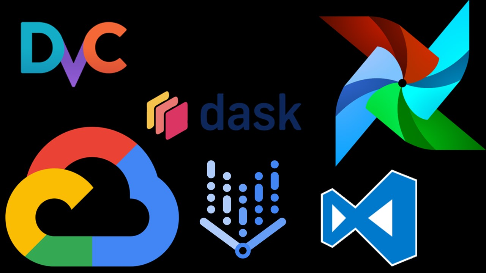
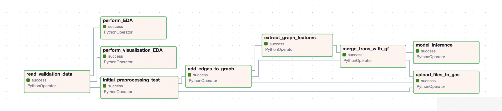
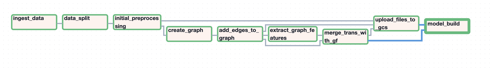
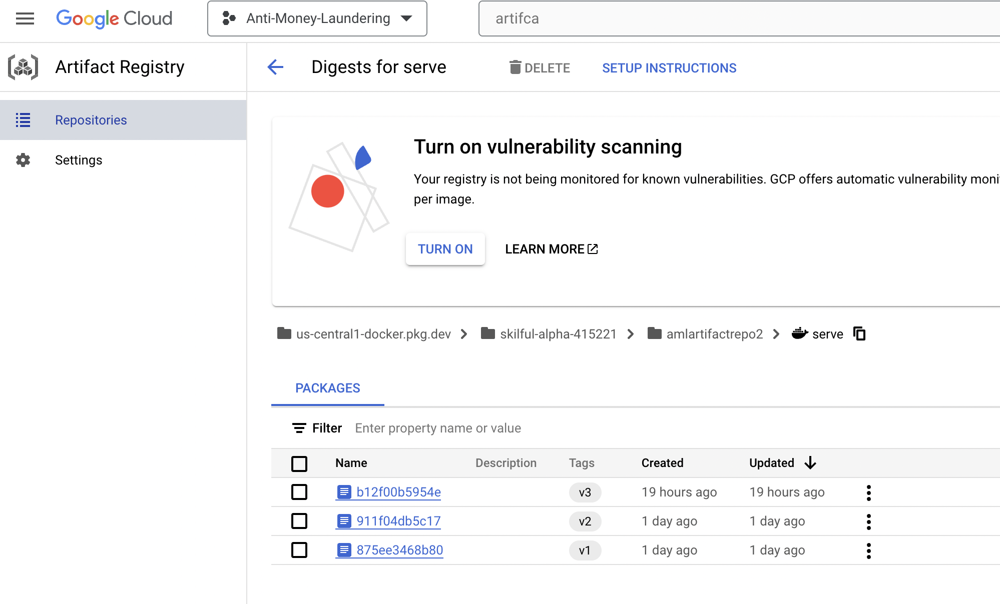
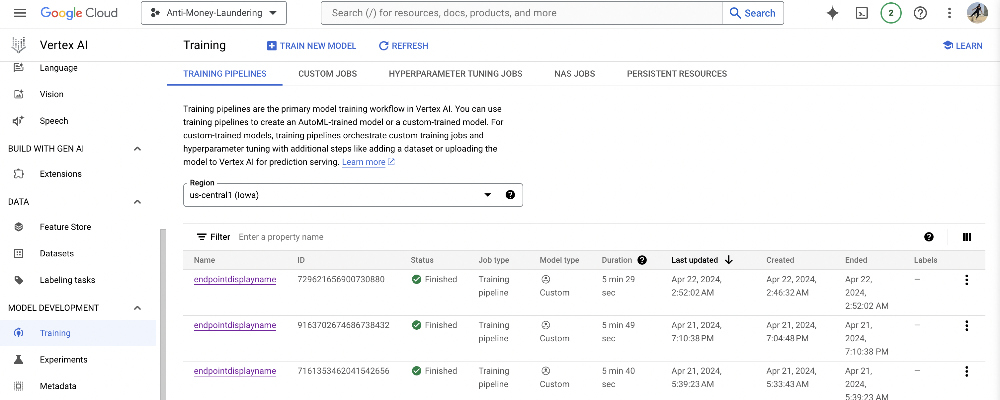
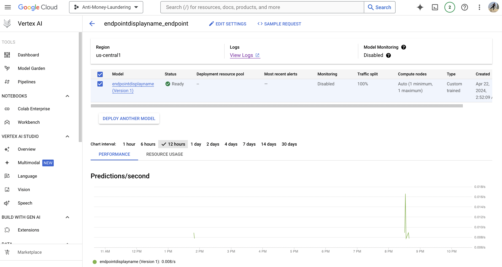
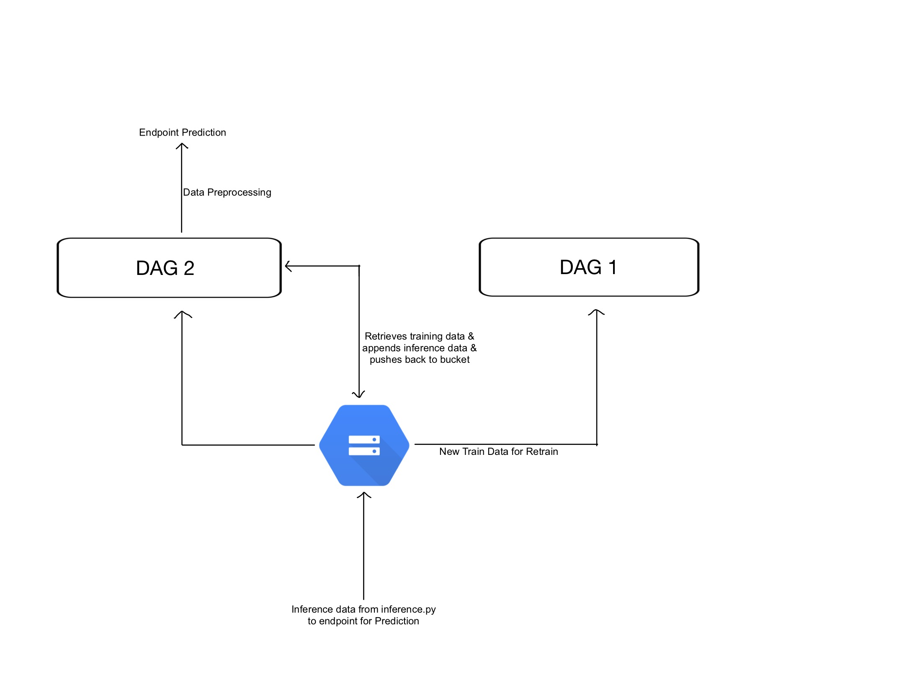
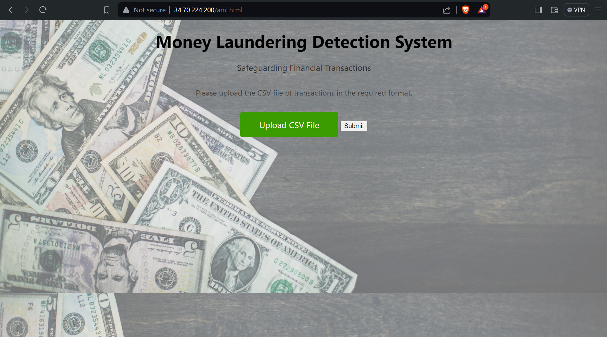

# Money Laundering Detection using Machine Learning
[Adinjay Phadkule](https://github.com/adinjayp) | [Krishna Barfiwala](https://github.com/krishnabx) | [Navya Pragathi](https://github.com/Navya-89) | [Utkarsh Singh](https://github.com/UtkarshS007) |  [Vishal Basutkar](https://github.com/vishalbns) | [Yash Gaikwad](https://github.com/YashRGaikwad)


## Introduction
 Money laundering is a significant financial crime involving the process of making illicitly obtained money appear to come from a legitimate source. Our project aims to address this issue by creating an automated Anti-Money Laundering (AML) detection product using Machine Learning (ML). The goal is to develop a clean and streamlined solution that adheres to the latest MLOps recommendations and procedures learned in the IE7374 Machine Learning Operations course at Northeastern University, under the guidance of Prof. Ramin Mohammadi.


## Dataset Information
The dataset used for our AML detection project consists of financial transactions, including bank transfers and credit card transactions. The dataset is synthetically generated by IBM using a multi-agent virtual world model. It comprises two categories:

`LI`: Lower Illicit Ratio (Less Laundering)

`HI`: High Illicit Ratio (High Laundering)

For each category, datasets are available in three sizes:

`Small`: 5 million transaction records

`Medium`: 30 million records

`Large`: 180 million records


### Data Card
* Size: 35000000 rows x 11 Columns
* Data Types

Variable Name      |      Role     |    DType      | Description
:-------------      | :-------------: | :------------: | :-------------
Timestamp          | Feature  | object | Transaction time. Format: Year/Month/Day Hour/Minute
From Bank          | ID  | Integer | Numeric code for bank where transaction originates
From Account       | ID  | Object | Hexadecimal code for account where transaction originates
To Bank            | ID  | Integer | Numeric code for bank where transaction ends 
To Account         | ID  | Object| Hexadecimal code for account where transaction ends
Amount Received    | Feature  | Float | Monetary amount received in From account (in currency units of the next column)
Receiving Currency | Feature  | Object | Monetary amount received in From account (in currency units of the next column)
Amount Paid | Feature  | Float | Monetary amount paid (in currency units of the next column)
Payment Currency | Feature  | Object | Currency such as dollars, euros, etc of From account
Payment Format | Feature  | Object | How the transaction was conducted, e.g. cheque, ACH, wire, credit cards, etc.
Is Laundering | Feature  | Integer | Binary Value: 1 if it is laundering, 0 if not.
### Data Sources

* [Original Data](https://ibm.box.com/v/AML-Anti-Money-Laundering-Data) 
* [Latest Improved Data](https://www.kaggle.com/datasets/ealtman2019/ibm-transactions-for-anti-money-laundering-aml)
* [IBM Link](https://ibm.ent.box.com/v/AML-Anti-Money-Laundering-Data)

### Data Rights and Privacy

This data is released under the [CDLA-Sharing-1.0 license](https://spdx.org/licenses/CDLA-Sharing-1.0.html). 


## Installation
This project uses `Python >= 3.9`. Please ensure that the correct version is installed on your device. This project also works on Windows, Linux and Mac.

### Prerequisites
   1. git
   2. python>=3.9
   3. Google Cloud Platform (G.C.P.)

### User Installation

The steps for user installation on G.C.P. are as follows: 

1. Setup a project on GCP and create a service account that can be used by all members of the team by referring to the official instructions:
```
https://cloud.google.com/iam/docs/service-accounts-create
```

2. Setting up Dask Cluster

     Deploy a dataproc cluster with Dask. Create 1 Master VM and 2 Worker VMs to perform parallel computations.

   	Machine type - c2d-highmem-4
	CPU platform - AMD Milan
	Create an external IP for the Master VM
* **Reference Guide to Setup VM and DASK:**
 	
```
https://cloud.google.com/blog/products/data-analytics/improve-data-science-experience-using-scalable-python-data-processing
```

* **Initial Access (SSH) :** Connect each Virtual VM using SSH. Allows to execute commands on remote machine to set up dask cluster.
* **Master Node :** start the Dask scheduler on the master node.
```
python -m distributed.cli.dask_scheduler
```
scheduler acts as the central coordinator for the cluster, receiving tasks from your program and assigning them to available worker nodes.

* **Worker Node :** Start Dask Worker on each node
```
python -m distributed.cli.dask_worker <scheduler address>
```
`<scheduler address>` needs to be replaced with the actual IP address or hostname of the master node where the scheduler is running.

* SSH into the 3 VMs on GCP CLI using the service account.

3. Check python version >= 3.9

```
python --version
```
4. Installing GCSFS

```
pip install gcsfs
```
5. Intsalling other dependencies

```
pip install pandas
pip install datatable
pip install dask[complete]
pip install distributed
pip install networkx
pip install numpy
pip install airflow
```
6. Installation for TFDV

```
!python3 -m pip install scikit-learn
pip install tensorflow_data_validation
pip install utils
```

7. Clone repository onto the Master Virtual machine

```
git clone https://github.com/adinjayp/anti_money_laundering_project/blob/main/AML%20Data%20Preprocessing.ipynb
```
8. Installing DVC and Dependencies
```
pip install dvc[gs]
pip install dvc[all]
```
* Connecting To Bucket on GCS
```
dvc remote modify --local myremote credentialpath <JSON_PATH = './skilful-alpha-415221-4b349448e629.json'>
```
9. Install airflow using pip and Initialize Airflow Database
```
pip install apache-airflow
airflow db init
```
10. Start Airflow Web Server and Scheduler:
Airflow consists of several components, primarily the web server and the scheduler.
Start the web server by running:
```
airflow webserver --port 8080
airflow scheduler
```

11. 2 DAGs are created for the projected:
    - `airflowdag.py` - for initial training. Located in src/airflowdag.py
    - `airflowdagValidation.py` - for inference. Located in src/airflowdagValidation.py

13. After your code is deployed from GitHub through Actions to the VM, you are good to run the project. Run python `airflowdag.py`


## Tool used for MLOps

* GitHub Actions
* TFDV
* Docker
* Airflow
* DVC
* Dask
* Google Cloud Platform (GCP)

### GitHub Actions
GitHub Actions workflows are set on push and on pull requests for all branches.
Setting up Github Actions-
	Get the private key of the service account and store in secrets as `$SSH_PRIVATE_KEY.`
	Also store `$GCP_VM_HOST` and `$GCP_VM_USER` to the secrets.
`Deploy.yaml` file in Git Actions will deploy code to VM on every push to main branch.


### TFDV
Tensor Flow Data Validation is used to provide exploratory data analysis of the train data, and validate and compare drift for the incoming batches of test data. TFDV_EDA.ipynb file is created for train data EDA. Test Data Validation will be done soon.
### Airflow
This Airflow Directed Acyclic Graph (DAG) orchestrates a series of tasks for an Antimoney Laundering (AML) project. The DAG is designed to ingest, preprocess, analyze, and merge transactional data with graph features using Dask distributed computing. There are two DAGS that are being used to understand the series of tasks that need to be performed. One of the DAGS works with tasks related to the train data while the other DAG deals with tasks in accordance with validation and test data. The following tasks are involved in the train DAG:- 

ingest_data: Task to ingest data.
data_split: Task to split the raw data.
preprocess_data_task: Task to perform initial data preprocessing.
create_graph_task: Task to create a graph representation of the data.
feature_Extraction_task: Task to extract features from the graph data.
create_dask_dataframe_task: Task to create a Dask dataframe for parallel processing.
merge_trans_with_gf_task: Task to merge transactions with graph features.
upload_files_to_gcs_task: Task to upload the necessary files to the buckets to be stored for later use. 
Execution Flow:
The execution flow of tasks is as follows:

ingest_data_task >> data_split_task >> preprocess_data_task >> create_graph_task >> feature_Extraction_task >> create_dask_dataframe_task >> merge_trans_with_gf_task >> upload_files_to_gcs_task

Task Dependencies:
ingest_data_task output feeds into data_split_task.
data_split_task output is used by preprocess_data_task.
preprocess_data_task output is utilized by create_graph_task.
create_graph_task outputs are inputs for both process_graph_data_task and merge_trans_with_gf_task.
process_graph_data_task output is consumed by create_dask_dataframe_task.
create_dask_dataframe_task output is passed to merge_trans_with_gf_task.

The validation and test DAG, similar to the train DAG performs almost similar tasks with a minor few changes in the functions passed. The tasks are as follows:- 

ingest_validation_data_task: This performs the task read the validation and test datasets from the GCS buckets.
EDA_task: Here, analysis and visualizations are produced to better understand the datasets.
preprocess_validation_data_task: This tasks perform initial preprocessing of the validation and test dataset while using the dictionaries present in the GCS bucket to be passed as parameters to produce the desired results. 
create_graph_task: This produced a graph of the given datasets.
feature_Extraction_task: This tasks extracts the important features from the graphs that are required for the model.
create_dask_dataframe_task: Task to create a Dask dataframe for parallel processing.
merge_trans_with_gf_task: Task to merge transactions with graph features.
upload_files_to_gcs_task: This task is used to upload the results and required files to the GCS buckets for later use. 
The execution flow of tasks is as follows:

read_validation_data_task >> preprocess_validation_data_task >> create_graph_task >> feature_Extraction_task >> create_dask_dataframe_task >> merge_trans_with_gf_task >> upload_files_to_gcs_task 

### DVC
DVC facilitates the versioning of datasets and machine learning models. By creating snapshots of the data used for training alongside the corresponding code, DVC ensures reproducibility and traceability. This allows you to recreate any previous state of your project, providing a vital audit trail.

DVC operates by storing only metadata, keeping the actual data in cloud storage or other designated remote locations. This promotes efficiency by keeping the codebase clean and lightweight. DVC integrates seamlessly with Git, enabling you to leverage Git repositories for managing code while using DVC repositories specifically for data and models. This two-repository approach offers a clear separation of concerns, promoting better organization and manageability.

### Google Cloud Platform
We used GCP to host our data and all other services on it. We created 3 VM instances on GCP - 1. Master Instance and the other two Worker VMs. 

GCP empowers efficient implementation of machine learning pipelines while ensuring proper management of intermediate files generated during modular tasks. Its functionalities are particularly well-suited for the temporary storage and retrieval of data needed within the various stages of a modularized workflow.


**Facilitating Access with Service Accounts** 

To leverage GCP's services, initialization of a service account is essential. This account serves as a secure identity for your application within the GCP ecosystem. It grants the application the necessary permissions to access and utilize GCP's resources and services.
## Data Pipeline


________________________________________________________________________________________________________________________________________________________________________
**DAG Flow**





### Data Pipeline Components

#### 1. Downloading the data
   Data was downloaded from the [IBM Link](https://ibm.ent.box.com/v/AML-Anti-Money-Laundering-Data) and uploaded on board the Google Cloud Storage.

#### 2. Exploratory Analysis and Tensor Flow Data Validation
We performed EDA on the train and validation data separately in a Jupyter notebook - TFDV_EDA.ipynb. Since this data is clean transactional data, we found there were no null values or datatype issues to handle during preprocessing. This notebook is to understand the transactions, accounts, banks, the split of payment modes, etc.


#### 3. Data Ingestion and Split

* `ingest_data.py`: Retrieves train and test data from Google Cloud Storage bucket.
* `data_split.py`: Splits the train data into train and validation datasets.

`**All below files are in the src folder**`
#### 4. Initial Preprocessing and Graph creation

* `preprocessing.py`: Performs initial preprocessing on the transaction data like timestamp formatting and converting account numbers to nodes.
* `create_graph.py`: This uses the initial train data and creates a Graph by calling add_edges_to_graph.py.
* `add_edges_to_graph.py`: Receives the graph object and a dataframe; Identifies nodes and adds edges to the graph. Dask is used to perform the addition of edges in parallel.

#### 5. Feature engineering and Final Data Preparation
* `feature_Extraction.py`: Creates a dask data frame of unique nodes.
* `pre_extraction.py`: Receives the nodes and returns graph features like degree, centrality etc.
* `dask_handling.py`: Creates and returns a dask dataframe of the graph features.
* `graph_operations.py`: Merges the train data frame with the graph features data frame for the to and from nodes.
* `update_bucket.py`: Pushes updated Graph and a few data dictionaries that are required for inferencing.

#### 6. Data preparation for inference dataset
* `inference.py`: Retrieves updated graph and other dictionaries, performs data validation checks, performs preprocessing and updates the graph and pushes the updated data to the bucket.

#### 7. Data Card After Preprocessing and Feature Engineering

Variable Name      |      Role     |    DType      | Description
:-------------     | :-------------: | :------------: | :-------------
`Index`              |    ID           | int64          |
`From_ID`            |    ID           | int64          | Hexadecimal code for account where transaction originates
`To_ID`              |    ID           | int64          | Hexadecimal code for account where transaction ends
`Timestamp`          |    ID           | float64        |
`Amount_Paid`        |  Feature        | float64        | Monetary amount paid (in currency units of the next column)
`Payment_Currency`   |  Feature        | int64          | Currency such as dollars, euros, etc of From account
`Amount_Received`    |  Feature        | float64        | Monetary amount received in From account (in currency units of the next column)
`Receiving_Currency` |  Feature        | int64          | Monetary amount received in From account (in currency units of the next column)
`Payment_Format`     |  Feature        | int64          | How the transaction was conducted, e.g. cheque, ACH, wire, credit cards, etc.
`Is_Laundering`      |  Feature        | int64          | Binary Value: 1 if it is laundering, 0 if not.
`from_degree`        |     Feature     | int64          | number of edges incident on a node originating from it. 
`from_in_degree`     |     Feature     | int64          | The number of edges pointing towards a node, indicating incoming edges to the node.
`from_out_degree`    |     Feature     | int64          | The number of edges originating from a node, indicating outgoing edges from the node.
`from_clustering_coeff`|   Feature     | float64        | This measures the degree to which nodes in a graph tend to cluster together. 
`from_degree_centrality`|  Feature     | float64        | It measures the importance of a node in a graph based on the number of edges incident upon it. 
`to_degree`          |     Feature     | int64          | Similar to from_degree, but concerning the target node of an edge.
`to_in_degree`       |     Feature     | int64          | The number of edges pointing towards a node, but specifically for the target node of an edge.
`to_out_degree`      |     Feature     | int64          | The number of edges originating from a node, but specifically for the target node of an edge.
`to_clustering_coeff`|     Feature     | float64        | Similar to from_clustering_coeff, but concerning the target node of an edge.
`to_degree_centrality`|    Feature     | float64        | Similar to from_degree_centrality, but concerning the target node of an edge.

#### 8. Building and Deploying the Model
The `build.py` script is responsible for building and deploying the model to the Vertex AI Platform. It uses the aiplatform library to create a custom container training job and deploy the model to an endpoint. The `CustomContainerTrainingJob` class is a part of Google Cloud's Vertex AI Python client library, which allows users to create and manage custom container training jobs for machine learning models. A custom container training job enables you to run your training application in a Docker container that you can customize.

Artifact Registry:


Model:


Endpoint:


Retrain:


#### 9. Building the Frontend and Backend
* **aml.html:** This HTML file creates an interactive interface for users to upload transaction data, receive predictions on potential fraudulent transactions, and download processed data.
 	- File Upload: If a valid CSV file is selected, the `uploadFile()` function is called, which constructs a FormData object with the file and sends it to the server using a POST request to the `/process_csv` endpoint.

* **backend.py:** This Python Flask application serves as an intermediary between a user uploading a CSV file containing transaction data and a machine learning model hosted on Google Cloud's Vertex AI platform for fraud detection.
	- CSV File Processing Endpoint: A route `/process_csv` is defined to handle POST requests containing CSV files. Upon receiving a CSV file, it reads the file into a pandas DataFrame, converts it into a format expected by the Vertex AI endpoint, sends the data for prediction, and saves the prediction results along with the original data as CSV files.


**Front End Screenshot**


**Google Cloud Storage Bucket**

 


